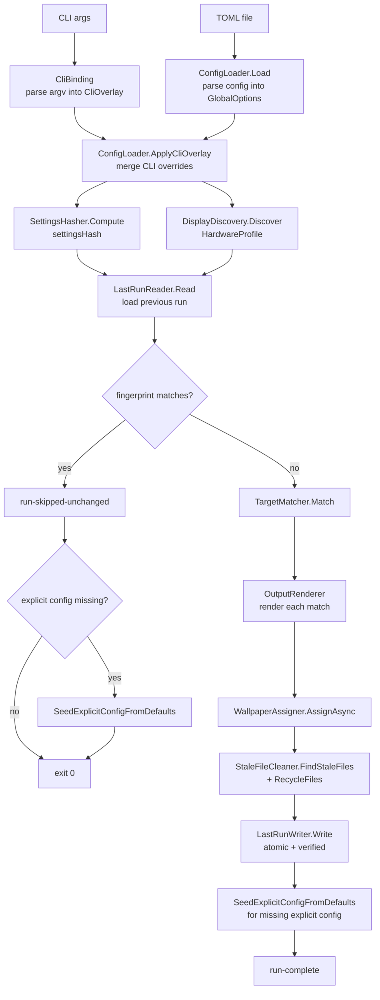

# Architecture

This document describes the runtime pipeline, module layout, and key design constraints of BgRaster. Useful when extending the renderer, debugging a misbehaving run, or evaluating AOT compatibility of a new dependency.

## Runtime pipeline



## Phase responsibilities

### 1. Configuration (`src/Configuration/`)
- **`CliBinding`** builds the `System.CommandLine` `RootCommand` and parses argv into a `CliOverlay` (every option a nullable scalar).
- **`ConfigLoader.Load`** reads TOML via Tomlyn's `TomlTable` document model and walks it manually into `GlobalOptions`. We deliberately do **not** use `Toml.ToModel<T>()` because reflection-based binding is incompatible with Native AOT trimming.
- **`ConfigLoader.ApplyCliOverlay`** wraps each non-null CLI scalar into a single-element array (CLI overrides are intentionally array-replacing, not array-appending) and merges into `GlobalOptions`.

### 2. Settings hashing (`src/Hashing/SettingsHasher.cs`)
A canonical text serialiser walks the resolved `GlobalOptions` in fixed section/property order, builds a UTF-8 byte stream, and hashes it with `SHA256.HashData`. The resulting hex digest is stored in `lastRun.toml`. Any semantic change to settings flips the hash and forces a re-render.

### 3. Hardware discovery (`src/Discovery/`)
- **`DisplayDiscovery`** uses `EnumDisplayDevicesW`, `EnumDisplaySettingsExW`, `MonitorFromPoint` + `GetDpiForMonitor`, and `QueryDisplayConfig` + `DisplayConfigGetDeviceInfo` to enumerate physical outputs and produce one `OutputRecord` each.
- The `OutputRecord.Id` is the `monitorDevicePath` (`\\?\DISPLAY#...`) form — the same string accepted by `IDesktopWallpaper::SetWallpaper`. This is the linchpin that allows us to assign each PNG to its correct monitor.
- All P/Invoke is via `LibraryImport` (source-generated marshalling) — no `DllImport`, no `[ComImport]`.

### 4. Early-exit fingerprint (`Program.cs:39-56`)
Compares three things between `lastRun.toml` (or `.dry.toml` for no-assignment) and the current state:
- assembly informational version
- settings hash
- hardware profile (count, IDs, position, resolution, rotation, DPI — sorted by Id)

If all three match, the run prints `run-skipped-unchanged` and exits without rendering or touching wallpapers. If the user supplied an explicit config path that did not exist at startup, BgRaster still seeds that file on this early-exit path.

For the full config-selection and skip/seeding decision process, see [Config File Logic](config-file-logic.md).

### 5. Target matching (`src/Resolution/TargetMatcher.cs`)
Walks the configured `[[output]]` list against the discovered `HardwareProfile` and emits a discriminated union:
- `MatchResult.Matched(OutputRecord, OutputOptions)` — render this.
- `MatchResult.NotFound(OutputOptions)` — configured target has no hardware match.
- `MatchResult.Duplicate(OutputOptions, OutputRecord)` — a later `[[output]]` claimed an output already taken.

First-match-wins by traversal order. Integer targets match by index; string targets match by exact `OutputRecord.Id`.

### 6. Option resolution (`src/Resolution/`)
- **`OptionsResolver.Resolve`** flattens cycled global arrays + per-output overrides into a `ResolvedOptions` struct holding parsed pixel floats and `SKColor` values (no unit strings).
- **`OptionsResolver.ResolveForSlice`** does the same for a slice, using slice dimensions as the new viewport for unit resolution.
- **`FieldSubstitutor.Substitute`** expands `${MachineName}`, `${OutputWidth}`, `${OutputHeight}`, `${OutputIndex}`, `${OutputIndexPlusOne}`, `${OutputLetter}`, `${OutputName}`, and (in slice scope) `${SliceWidth}`, `${SliceHeight}`, `${SliceIndex}`, `${SliceIndexPlusOne}`, `${SliceLetter}`.

### 7. Rendering (`src/Rendering/`)
The renderer composes a fixed sequence of `ILayer` instances onto an `SKBitmap` sized to the output (or, for sliced outputs, clipped to each slice rect):

```
BackgroundLayer → GridLayer → AlternatingLayer → BorderLayer
  → CircleLayer → CrosshairLayer → LabeledEdgesLayer → LogoLayer → TextLayer
```

Each layer reads from `RenderContext` (which carries `OutputRecord`, resolved options, viewport size, and canvas offset) and is allowed to short-circuit when its inputs are zero / disabled.

Notable layers:
- **`AlternatingLayer`** uses `SKBitmap.GetPixels()` with an unsafe pointer to set pixels in O(W×H) without per-pixel allocation.
- **`GridLayer`** optionally draws WCAG-style luminance-aware coordinate labels: text color is chosen per cell based on `0.299·R + 0.587·G + 0.114·B` of the cell background color.
- **`LogoLayer`** branches by extension: PNG/JPG via `SKBitmap.Decode`; SVG via `SvgRenderer.TryRender` (a hand-rolled XmlReader-based parser supporting a small subset of SVG). On any failure, the embedded `resources/gsp.svg` logo resource is used; if even that fails, a programmatic orange cross is drawn.
- **`TextLayer`** uses an embedded `Gidolinya-Regular.otf` via `Assembly.GetManifestResourceStream`, loaded once into a `static SKTypeface`.

The bitmap is encoded to PNG (`SKEncodedImageFormat.Png`, quality 100) and written to `<outputDir>/<timestamp>_<safeId>.png`.

### 8. Wallpaper assignment (`src/Wallpaper/`)
- **`WallpaperAssigner`** does `CoInitializeEx` + `CoCreateInstance(CLSID_DesktopWallpaper, CLSCTX_LOCAL_SERVER)`, then resolves `IDesktopWallpaper::SetWallpaper` (vtable index 7) through manual `delegate* unmanaged[Stdcall]` function-pointer arithmetic. There is no `[ComImport]` or runtime marshalling involved.
- Per-output failures are logged and reported as `wallpaper-assignment-failed` but do not stop the rest of the assignments.
- Skipped entirely when `--no-assignment true`.

### 9. Stale-file cleanup (`src/FileLifecycle/StaleFileCleaner.cs`)
- **`FindStaleFiles`** scans the output directory for files whose names match the BgRaster timestamp pattern but are not in the current run's assigned set.
- **`RecycleFiles`** is a pending implementation; currently it returns the input as the "unrecycled" list. See [deferred task 7](future-plans.md).

### 10. State persistence (`src/StateCache/`)
- **`LastRunWriter.Write`** hand-emits TOML (Tomlyn's comment API on `[[array_of_tables]]` headers is fragile in 0.17.x). It writes to `<path>.tmp`, parses it back via `LastRunReader.Read`, and only `File.Move`'s into place if the round-trip matches the in-memory state field-by-field. On mismatch it deletes the temp and preserves the previous file — diagnostic, not a hard failure.
- Each `[[hardware_output]]`, `[[output]]`, and `[[output.slice]]` is preceded by a `# bg-raster: status=...` comment summarising the run's outcome for that block.
- **`LastRunReader.Read`** returns `null` on missing file, parse failure, or schema mismatch; the caller treats that as "no previous run".

## Cross-cutting concerns

### Native AOT compatibility
The project publishes with `PublishAot=true`, `TrimMode=full`, `InvariantGlobalization=true`. Constraints this imposes:

- **No reflection-based binding.** Tomlyn is used in document mode only; `System.CommandLine` options are bound through explicit setters; SVG parsing uses `XmlReader` directly.
- **No `[ComImport]`.** All COM (`IDesktopWallpaper`) is hand-rolled vtable calls.
- **All P/Invoke uses `LibraryImport`** with `StringMarshalling.Utf16` for `W`-suffixed APIs.
- **No invariant-culture-sensitive ToString/Parse without explicit culture.** All numeric parsing uses `CultureInfo.InvariantCulture`.

`DisableRuntimeMarshalling=true` is intentionally **not** set — see [deferred task 9](future-plans.md). SkiaSharp's interop has not been validated under that flag.

### DPI awareness
`src/app.manifest` sets `dpiAwareness` to `PerMonitorV2`. Combined with `GetDpiForMonitor`, the rendered PNG dimensions match the physical pixel grid of each output, regardless of mixed-DPI desktops.

### Privileges
The manifest declares `requestedExecutionLevel level="asInvoker"`. BgRaster does not implement an elevation-relaunch path; it runs in the caller's token and reports wallpaper-assignment failures through normal HRESULT/status diagnostics.

### Embedded resources
Two resources are embedded into the AOT binary: `resources/gidole/Gidolinya-Regular.otf` (font) and `resources/gsp.svg` (logo). Access is via `Assembly.GetManifestResourceStream` — AOT-safe (the resources are linked into the assembly's manifest, not loaded by dynamic type).

## Module layout

| Folder | Responsibility |
|---|---|
| `src/Configuration/` | CLI parsing, TOML loading, overlay merging. |
| `src/Discovery/` | Win32 / Display Config display enumeration. |
| `src/FileLifecycle/` | Filename generation, stale-file detection. |
| `src/Hashing/` | Canonical settings hash. |
| `src/Models/` | Plain `record` types — no behaviour. |
| `src/Parsing/` | Unit, color, fit-mode parsing. |
| `src/Rendering/` | SkiaSharp layer pipeline, font, SVG renderer. |
| `src/Resolution/` | Override merging, target matching, substitution. |
| `src/StateCache/` | `lastRun.toml` read/write with round-trip verification. |
| `src/Wallpaper/` | COM `IDesktopWallpaper` vtable interop. |
| `src/Program.cs` | Pipeline orchestration. |
